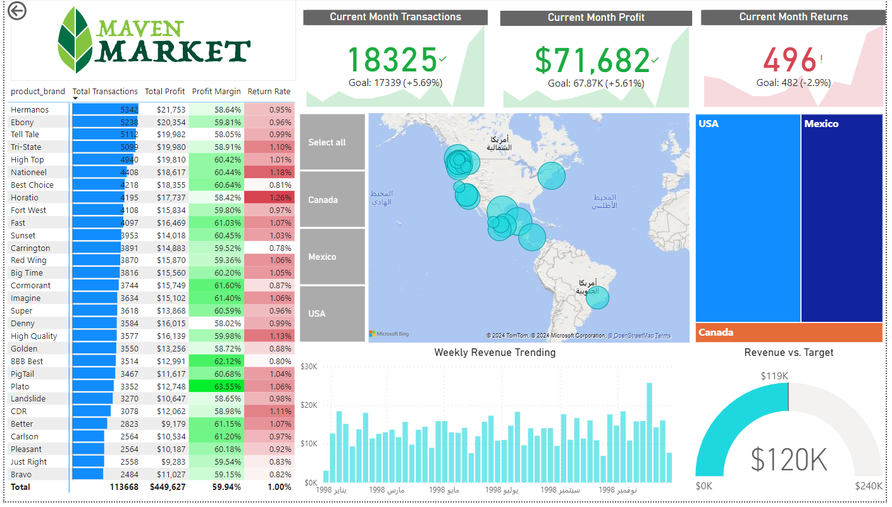

# Maven Market

For this project, I utilized Power BI to clean, analyze and visualize a dataset from Maven Analytics called Maven Market. **Maven Market** is a business which owns a variety of grocery stores of differing sizes across multiple countries including the United States, Canada and Mexico.

## Dashboard

 

## Data Model

## Insight Analysis

From an overall, we can begin by examining the **KPI cards** listed at the top which each show a specific metric based on the **current month**. As a reminder, these cards each have their own goal for the **current month**, which is the metric from the **previous month**.

The first card `Transactions` shows that we have surpassed our target for the month by **5.69%** or approximately **1,000 transactions**. The next card shows the current month’s `profit` and again we can see that we have exceeded our previous month’s profit by **5.61%** or approximately **$3,800**. Lastly, we have the `Returns` KPI card which shows that we have exceeded our goal for returns and therefore the values are labeled in red.

We will further evaluate these cards later on in the analysis. From an overall standpoint, Maven Market appears to be in overall good health, but there are clearly some areas for improvement. 

Using the **matrix** I can check which brands had the highest transactions through the whole company and found the `top 3` are **Hermanos (5,342)**, **Ebony (5,238)**, and **Tell Tale (5,112)**. All 3 have relatively `good profit margins` of at least **58 percent**.

The **USA** and **Mexico** both seem to `have fairly steady transactions, profits, profit margins and low return rates`. However, when we look at the `performance` of the stores in **Canada** the data is telling a much different story. `Total transactions` in **Canada (3,613)** are `much lower` compared to the **USA (21,305)** and **Mexico (16,094)**. **Canada’s** `Total Profit` **(13,915)** is also substantially `lower than` the **USA (80,618)** and **Mexico’s (61,220)**. `Profit Margin` remains almost the exact same among the 3 countries. Finally, **Canada’s** `Return Rate` **(11.25%)** is `more than 5 times higher than` that of the **USA** and **Mexico’s**.

We could explain the `low transactions` for **Canada** in comparison to that of the 2 other countries? When examining the map I can see `Maven Market` only has **presence in 2 cities within Canada**, while the **USA** and **Mexico** have `more than 10 cities with stores each`. Examining the `KPI` metrics for the Canadian stores, shows that they are `failing to meet their current month’s Transactions and Profit` by **almost half**. Compare this to the **USA** and **Mexico** stores who are more than meeting their goals. Additionally, when looking at the `Weekly Revenue Trending` column chart I see that for the `last year Revenue` for these **Canadian stores** has been very `inconsistent and low`.

